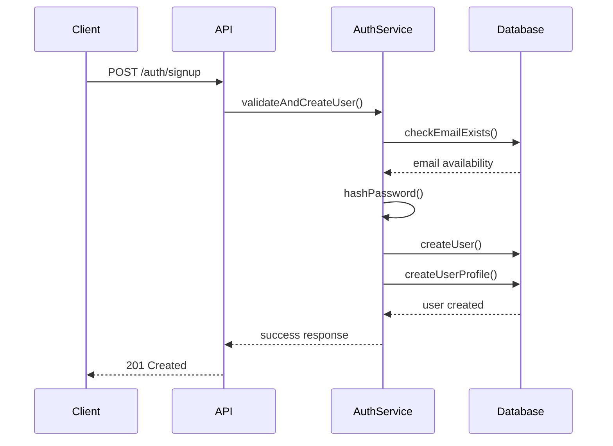
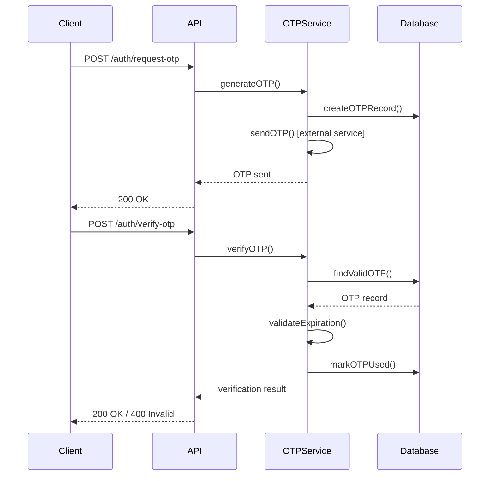
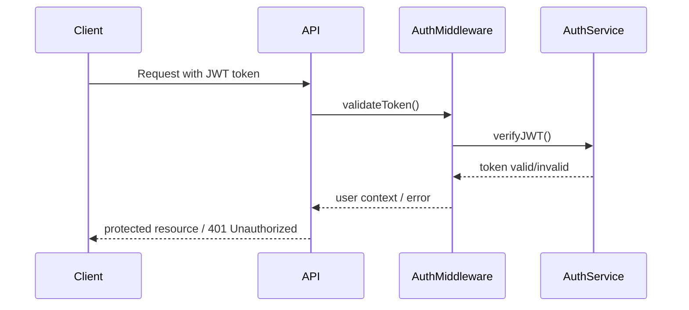

# Design Document: Backend Authentication Service

## Overview

This design outlines a comprehensive backend-only authentication service built with Node.js, Express.js, and MongoDB. The system provides secure user authentication, authorization, and account management through RESTful APIs. The architecture emphasizes security, scalability, and maintainability while following industry best practices for authentication systems.

## Architecture

The system follows a layered architecture pattern with clear separation of concerns:

```
┌─────────────────┐
│   API Routes    │ ← Express.js routes handling HTTP requests
├─────────────────┤
│   Controllers   │ ← Business logic and request/response handling
├─────────────────┤
│   Services      │ ← Core business logic and external integrations
├─────────────────┤
│   Middleware    │ ← Authentication, validation, rate limiting
├─────────────────┤
│   Models        │ ← Mongoose schemas and database interactions
├─────────────────┤
│   Database      │ ← MongoDB for persistent storage
└─────────────────┘
```

### Key Architectural Principles

- **Stateless Authentication**: JWT tokens eliminate server-side session storage
- **Modular Design**: Clear separation between routes, controllers, services, and models
- **Security-First**: Input validation, rate limiting, and secure password handling
- **Audit Trail**: Comprehensive logging for security and compliance

## Components and Interfaces

### 1. Database Models

#### Users Collection
```javascript
{
  _id: ObjectId,
  email: String (unique, required),
  phone: String (optional),
  passwordHash: String (required),
  isVerified: Boolean (default: false),
  status: String (enum: ['active', 'blocked'], default: 'active'),
  lastLoginAt: Date,
  createdAt: Date,
  updatedAt: Date
}
```

#### UserProfiles Collection
```javascript
{
  _id: ObjectId,
  userId: ObjectId (ref: Users._id, required),
  displayName: String,
  avatarUrl: String,
  preferences: {
    notifications: Boolean,
    theme: String,
    language: String
  },
  updatedAt: Date
}
```

#### OTPVerifications Collection
```javascript
{
  _id: ObjectId,
  userId: ObjectId (ref: Users._id, required),
  otp: String (required, 6 digits),
  type: String (enum: ['signup', 'login', 'reset'], required),
  expiresAt: Date (required),
  used: Boolean (default: false),
  createdAt: Date
}
```

#### AuditLogs Collection
```javascript
{
  _id: ObjectId,
  userId: ObjectId (ref: Users._id, optional),
  action: String (required),
  ipAddress: String,
  userAgent: String,
  metadata: Object,
  createdAt: Date
}
```

### 2. API Endpoints

#### Authentication Routes
- `POST /auth/signup` - User registration
- `POST /auth/login` - User authentication
- `POST /auth/request-otp` - Generate OTP for verification
- `POST /auth/verify-otp` - Verify OTP code
- `POST /auth/resend-otp` - Resend OTP with rate limiting
- `POST /auth/forgot-password` - Initiate password reset
- `POST /auth/reset-password` - Complete password reset

### 3. Core Services

#### AuthService
- User registration and login logic
- Password validation and hashing
- JWT token generation and validation
- User status management

#### OTPService
- OTP generation (6-digit numeric codes)
- OTP validation and expiration handling
- Rate limiting for OTP requests
- OTP cleanup for expired entries

#### SecurityService
- Password strength validation
- Input sanitization and validation
- Audit logging
- Rate limiting implementation

### 4. Middleware Components

#### Authentication Middleware
- JWT token validation
- User session verification
- Protected route access control

#### Rate Limiting Middleware
- Request frequency limiting per IP/user
- OTP-specific rate limiting (3 requests per 15 minutes)
- Configurable limits for different endpoints

#### Validation Middleware
- Input schema validation using Joi or similar
- Request sanitization
- Error handling and response formatting

## Data Models

### User Registration Flow


### OTP Verification Flow


### JWT Authentication Flow


Now I need to use the prework tool to analyze the acceptance criteria before writing the Correctness Properties section:

## Correctness Properties

*A property is a characteristic or behavior that should hold true across all valid executions of a system—essentially, a formal statement about what the system should do. Properties serve as the bridge between human-readable specifications and machine-verifiable correctness guarantees.*

### Property 1: User Registration Validation
*For any* valid email and password combination, user registration should create exactly one user account with a corresponding profile record, and the stored password should be a bcrypt hash, not the original password.
**Validates: Requirements 1.1, 1.5, 1.6**

### Property 2: Duplicate Email Prevention
*For any* email address, attempting to register multiple users with the same email should succeed only for the first registration and fail for all subsequent attempts.
**Validates: Requirements 1.2, 8.1**

### Property 3: Input Validation and Sanitization
*For any* invalid input data (malformed emails, weak passwords, malicious content), the system should reject the input with appropriate validation errors and sanitize any potentially harmful content.
**Validates: Requirements 1.3, 1.4, 7.1, 7.2**

### Property 4: Authentication Success and Tracking
*For any* valid user credentials, successful login should return a valid JWT token, update the lastLoginAt timestamp, and create an audit log entry.
**Validates: Requirements 2.1, 2.3, 2.5**

### Property 5: Authentication Failure Handling
*For any* incorrect credentials, login attempts should fail with appropriate error messages and never reveal whether the email exists in the system.
**Validates: Requirements 2.2**

### Property 6: JWT Token Security and Structure
*For any* generated JWT token, it should contain user ID, expiration time, and role information, be properly signed with a secure secret, and allow access to protected resources only when valid and not expired.
**Validates: Requirements 6.1, 6.2, 6.3, 6.4, 6.5**

### Property 7: OTP Generation and Lifecycle
*For any* OTP request, the system should generate a 6-digit numeric code with 10-minute expiration, allow verification only once within the expiration period, and reject expired or already-used OTPs.
**Validates: Requirements 3.1, 3.2, 3.3, 3.4, 3.5**

### Property 8: OTP Rate Limiting
*For any* user or IP address, OTP requests should be limited to maximum 3 requests per 15 minutes, return rate limit errors when exceeded, and reset the counter after the time period expires.
**Validates: Requirements 4.1, 4.2, 4.3, 4.4**

### Property 9: Password Reset Security
*For any* password reset flow, the system should generate a reset OTP for valid emails, update the password hash when valid OTP and new password are provided, invalidate all existing JWT tokens for that user, and validate the new password meets security requirements.
**Validates: Requirements 5.1, 5.2, 5.3, 5.4**

### Property 10: Comprehensive Audit Logging
*For any* security-relevant action (login attempts, password resets, OTP requests), the system should create detailed audit log entries with user ID, action type, IP address, user agent, and timestamp.
**Validates: Requirements 2.5, 5.5, 7.5, 8.4**

### Property 11: Data Security and Privacy
*For any* API response, the system should never include password hashes, include appropriate security headers, and maintain referential integrity between all related database collections.
**Validates: Requirements 7.3, 7.4, 8.2, 8.3, 8.5**

### Property 12: Password Security Round Trip
*For any* user account, the stored password should be verifiable against the original password using bcrypt comparison, but the original password should never be recoverable from the stored hash.
**Validates: Requirements 1.5, 2.4**

## Error Handling

### Error Response Format
All API errors follow a consistent JSON structure:
```javascript
{
  "success": false,
  "error": {
    "code": "ERROR_CODE",
    "message": "Human-readable error message",
    "details": {} // Optional additional context
  },
  "timestamp": "2024-01-05T10:30:00Z"
}
```

### Error Categories

#### Validation Errors (400 Bad Request)
- Invalid email format
- Weak password requirements
- Missing required fields
- Invalid OTP format

#### Authentication Errors (401 Unauthorized)
- Invalid credentials
- Expired JWT token
- Invalid JWT signature
- Missing authentication token

#### Authorization Errors (403 Forbidden)
- Account blocked/suspended
- Insufficient permissions
- Rate limit exceeded

#### Resource Errors (404 Not Found)
- User not found
- Invalid OTP code
- Expired OTP

#### Server Errors (500 Internal Server Error)
- Database connection failures
- External service unavailable
- Unexpected system errors

### Error Handling Strategy

1. **Input Validation**: Validate all inputs at the controller level before processing
2. **Graceful Degradation**: Continue operation when non-critical services fail
3. **Error Logging**: Log all errors with appropriate severity levels
4. **Security**: Never expose sensitive information in error messages
5. **Rate Limiting**: Implement progressive delays for repeated failures

## Testing Strategy

### Dual Testing Approach

The authentication service requires both unit testing and property-based testing for comprehensive coverage:

**Unit Tests**: Verify specific examples, edge cases, and error conditions
- Test specific email formats and password combinations
- Test exact rate limiting boundaries (3rd vs 4th request)
- Test specific JWT token expiration scenarios
- Test database connection failures and recovery

**Property Tests**: Verify universal properties across all inputs
- Test authentication works for any valid credentials
- Test rate limiting works for any request pattern
- Test OTP generation produces valid codes for any user
- Test password hashing is secure for any password

### Property-Based Testing Configuration

- **Testing Framework**: Use `fast-check` for JavaScript property-based testing
- **Test Iterations**: Minimum 100 iterations per property test
- **Test Tagging**: Each property test must reference its design document property
- **Tag Format**: `// Feature: backend-authentication, Property {number}: {property_text}`

### Testing Requirements

1. **Comprehensive Coverage**: Both unit and property tests are required
2. **Security Focus**: Extensive testing of authentication and authorization flows
3. **Performance Testing**: Rate limiting and concurrent request handling
4. **Integration Testing**: Database operations and external service interactions
5. **Error Scenario Testing**: Network failures, invalid inputs, and edge cases

### Test Data Management

- **Test Database**: Separate MongoDB instance for testing
- **Data Cleanup**: Automatic cleanup between test runs
- **Mock Services**: Mock external OTP delivery services
- **Seed Data**: Consistent test user accounts and scenarios

The testing strategy ensures that both specific examples work correctly (unit tests) and that the system behaves properly across all possible inputs (property tests), providing confidence in the system's correctness and security.